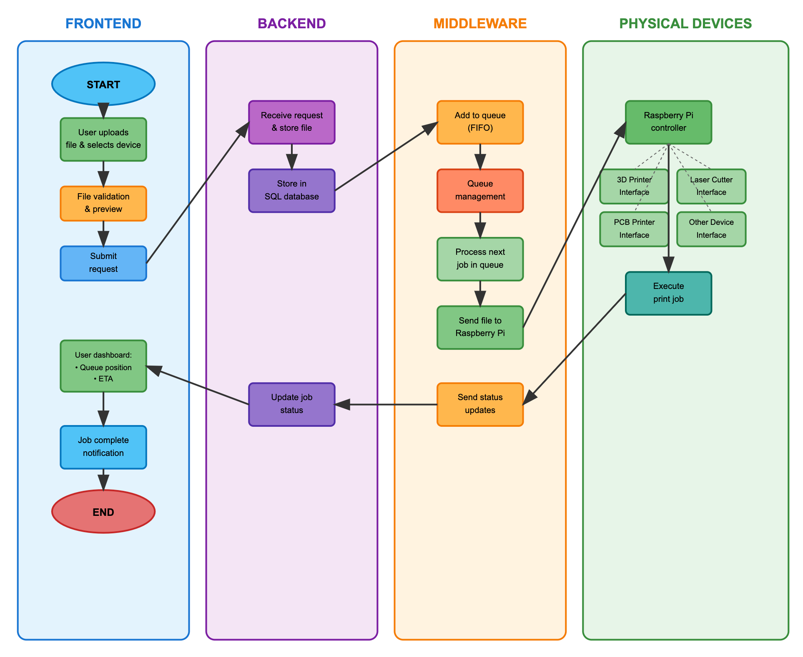

# Architecture Overview (6/18/2025)

The user shall interface with a web app or the discord client where they shall be able to upload the files for their project. From there, all shall be handled programmatically from user submission to print starting.

## Core Tenants

1. The user shall not necessarily face a gap outside of their knowledge whilst using the project submission system.
2. The user shall have quick responses to general queries about their projects status.
3. The code for the upload submissions shall be easily extensible, robust, and readable by the lay programmer insofar to promote addition from programmers of all levels

## User Flow Chart

### Frontend

1. The user shall be prompted to input their files and to which type of device they want their print to be done on (e.g. laser cutter, 3d printer, pcb printer, etc.)
2. Once the project files are submitted, the user shall be told their queue position and their ETA till printing starts. Once printing starts, the user shall be alerted and shall be told the ETA for their print, as stated by the printer or printing program.
3. The user shall be able to prompt the discord, likely via a discord bot, for the status of their project

### Backend

1. The backend shall handle the RESTful API to communicate with the SQL server.
2. The backend shall store the project files in the SQL server and receive the job update status that then may percolate to discord or other sources.

### Middleware

1. The middleware shall handle queue management.
2. The middleware shall communicate with the SQL server to pull files from it to then move them to the raspberry pi's.
3. The queue process will act as priority based first in first out (FIFO) with such priorities:
    - Stated Priority level (school project vs. personal project)
    - If the student has tried to print this same project before and the print failed

    As for best practice based on these priorities:
    - School projects take precedent over personal project
    - Failed project prints take precedent over first time project prints
    - School failed project prints take precedent over personal failed project prints and school first time prints take precedent over personal failed project prints

### Physical Devices

1. Physical Devices shall be set up for each printer so that easy, remote communication can be achieved. This will likely be done through Raspberry Pis.
